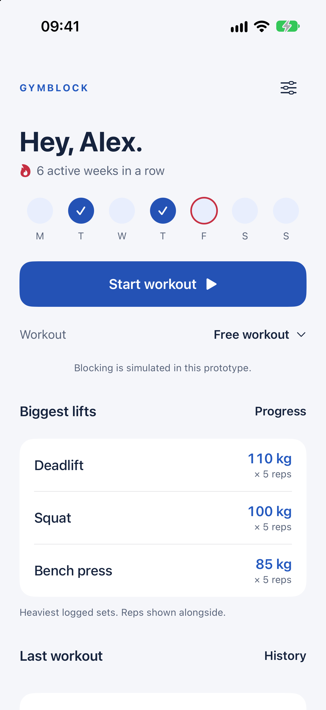
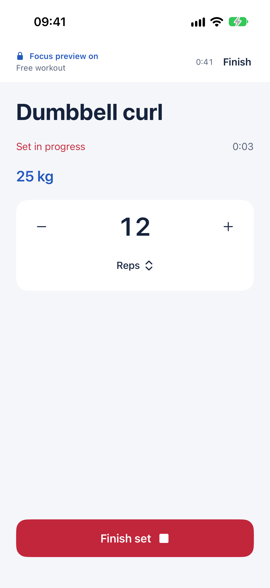
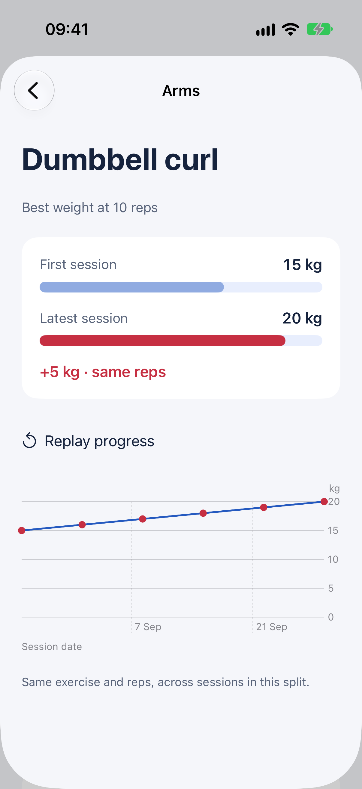

# GymBlock

A simple native SwiftUI workout prototype. Start immediately, log one set at a time, and keep your training on your device. Red and blue UI; optional splits; biggest lifts; exercise progress.

## Try it

Open **GymBlock.xcodeproj**, select the **GymBlock** scheme and an iPhone simulator, and Run. The project and shared scheme are included. Xcode with an iOS 17+ simulator is required; the verified simulator uses Xcode 27 and iOS 27.

The Debug scheme passes `--demo` automatically. A fresh install opens directly on Home with **Arms, Push and Legs**, roughly six weeks of sample workouts, records and progress. Home labels the sample history. You can add real test workouts, edit/create splits and reopen the app; everything saves locally. The demo loader never overwrites existing local history, splits or an active session. Remove the `--demo` Run argument to try clean onboarding, or use Settings → Load sample workouts after onboarding while the store is empty.

Alternatively, run `./run-simulator.sh`. It selects the booted iPhone or an available iPhone, builds, installs, launches with `--demo` and opens Device Hub. It does not publish or charge.

## Screenshots

Captured from the running iPhone simulator. More screens are in [screenshots](screenshots/).

  

## Main flow

1. **Start workout** on Home. Choose a split below the button if you want one; otherwise use **Free workout**.
2. Focus simulation begins immediately. Search `dum` for dumbbell exercises, or choose from the split.
3. Type the weight, use +/−, or tap the picker control for a native wheel and editable number. Switch kg/lb before starting. Weight range is 0–500 in the selected unit, fractional values allowed; zero means no added weight.
4. **Start set**, lift, adjust reps, then **Finish set**. There is no separate logging screen.
5. A 60-second rest begins automatically. Start next set whenever ready; change exercise between sets.
6. Finish workout to end the simulation and save the summary. A free workout can optionally be saved as a split.

**Settings → Splits** adds, edits and reorders exercises. Renaming a split keeps its progress links. **Progress** compares each exercise at the same rep count within a split, using before/after bars and a date chart. Home's biggest lifts show heaviest logged sets and reps. Cardio/stretching retain minutes-based logging. Reduce Motion and system appearance are supported.

## Limits

Blocking and purchases are simulated. The app cannot restrict other apps or lock the phone. There are no Screen Time entitlements/extensions or StoreKit/RevenueCat integrations. The paywall uses placeholder USD prices and charges nothing. No account, network API, analytics, backend or cloud sync exists; UserDefaults holds local data and iOS may include it in system backups.

This is a simulator prototype, not a physical-device, billing, distribution or App Store release. Code signing is disabled for the simulator. The old repository's Supabase, friends, subscriptions, Screen Time extensions and Live Activity implementation have been replaced by this smaller prototype. Previous code remains available in Git history.

## Development

`project.yml` is authoritative. Run `xcodegen generate` after adding/removing source files or changing configuration. There are no package dependencies.

Product → Test runs local logic checks and actual simulator journeys. CLI:

```sh
xcodebuild -project GymBlock.xcodeproj -scheme GymBlock \
  -destination 'platform=iOS Simulator,name=iPhone 17' \
  -parallel-testing-enabled NO test
```

Debug-only `--ui-reset` clears this app's local data for tests; avoid it when keeping workouts. Normal launches never reset data. Validation evidence is described in VALIDATION.md.
