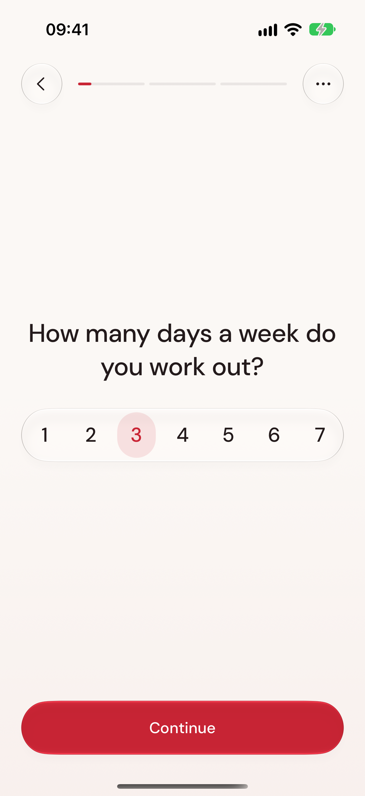
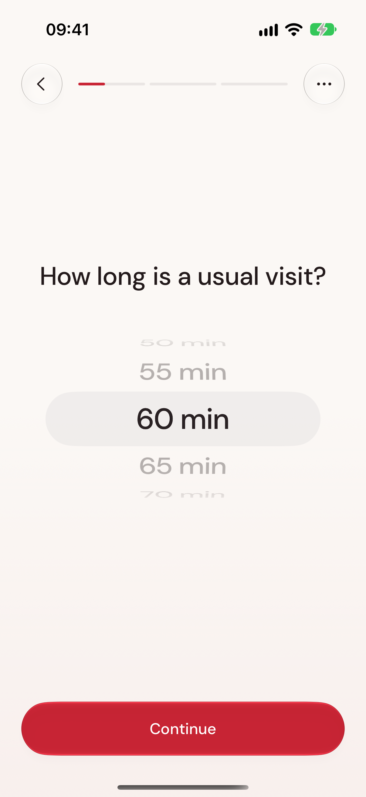
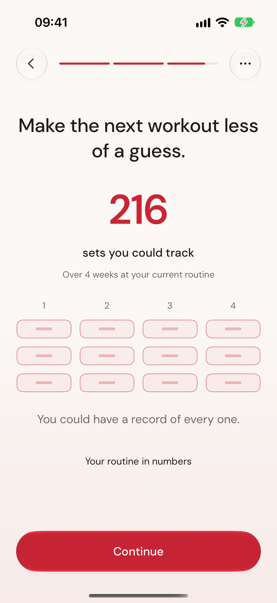

# GymBlock

A native SwiftUI workout prototype built around one action at a time. The visual design uses Speaking Coach’s DM Sans, warm paper, soft content surfaces and deliberate type hierarchy, with GymBlock’s red as the only brand accent. Native Liquid Glass controls sit above readable workout content.

## Try it

Open **GymBlock.xcodeproj**, select **GymBlock** and an iPhone simulator, then Run. Xcode 26+ with an iOS 17+ simulator is required. Liquid Glass uses the supported native controls on iOS 26+; earlier versions use native materials or bordered controls. The verified environment is Xcode 27 / iPhone 17 / iOS 27.

The shared Debug scheme passes `--demo`. An empty store opens Home with **Arms, Push and Legs**, six weeks of sample history, lift records and sample set/gap timings. The Home **Demo** label identifies that history. New test workouts and split edits save locally; relaunch keeps them. Demo loading never replaces existing history, splits or an active workout.

To try the complete onboarding, remove `--demo` on a fresh install. With existing data, **Settings → Edit routine answers** opens it without deleting workouts. For a clean test, Debug-only `--ui-reset` clears this app's data; use it only when resetting test data intentionally. Alternatively run `./run-simulator.sh` to build and launch the populated simulator.

## Workout flow

- Native navigation: **Home · History · Splits**. Home contains the streak, **Free workout** or optional split choice, and **Start workout**. It contains no lift-stat card.
- A split opens its first exercise ready to start. Free workout opens recent exercises and native search; type `dum` for dumbbell exercises.
- Choose a weight on the first use of an exercise; later sets remember it. Tap the weight for manual entry, a native wheel or +/−. Weight is 0–500 in the chosen kg/lb unit; fractions are supported. Zero is labeled **Bodyweight**. Changing units preserves the load and converts its display.
- **Start set → enter actual completed reps → Finish set.** Previous reps are a draft, not a target. Extra or fewer reps use the same flow. Reps support 1–999.
- **Rest elapsed** starts at 0:00 and counts up. **Start next set** works whenever you are ready. Changing exercises, switching tabs and relaunching preserve its original start; there is no expiry or configured rest duration.
- **Change exercise** and the exercise title stay tappable in every set state. After saving, switch immediately. During an unfinished set, choose **Save set and switch**, **Discard current set and switch** or **Keep training**. Earlier sets stay saved under their original movement. The session picker shows this workout, recent exercises and search.
- Tap the saved-set row to correct, delete or mark a warm-up. The visible **End workout** button stays in the workout navigation bar. **Workout options** contains uncommon actions, including cancelling an unperformed set, recording a zero-rep unsuccessful attempt, inspecting sets and adding a missed completed set.
- The **End workout** button saves completed work and ends the focus representation. An active set offers save/discard/keep-training choices. Unsuccessful attempts stay in history but never become lift records or completed-workout streaks.

The **Splits** tab is the direct route to the optional editor. Home’s **Manage splits** also selects that tab; the existing Settings shortcut remains available. Rename/reorder without losing progress identity. Deleting a split retains history. **History → Workouts** shows older sessions and editable sets. **History → Progress** contains best lifts as plain content, split comparisons, and **Training totals** with Reps / Weight moved / Sets trend and bar charts. Weight moved sums logged load × completed reps; bodyweight adds no guessed load, warm-ups count, and timed activity/attempts stay separate. You can browse these during training and use **Resume workout** or Home to return without losing the draft or counter. Progress compares either load at identical reps or reps at identical load, within the same exercise and split. The chosen before/after animation respects Reduce Motion; the chart is behind History.

## Onboarding

The workout-first route is **Welcome → days/week → visit length → reps → sets → exercises → scrolling → optional minutes → rest timing → logging/review → set timing → focus → rest → progress → ready**. Frequency exposes 1–7 in one selector. Every other numeric question uses one native inline wheel, with no duplicate number, pencil, preset buttons or editor sheet. The three lifting questions appear separately. Continue confirms the settled value; skipping leaves it unknown. Mostly timed and Varies remain in options. Older rep ranges and per-exercise details are preserved until explicitly replaced.

Only after the questions does the story show the routine's possible phone-free time, an upward rest example, an example comparison at the same weight and a prospective four-week record. **Just train** opens exercise selection with focus off. Ready offers **Start workout** and **Go to Home**. Focus setup is optional in the final options menu. No example or projection creates History entries. Demo data is still explicitly available in Settings or with `--demo`.

The estimate is `(total sets − 1) × minutes scrolling`, with an editable actual-break count. Three training days, six exercises, three sets and two minutes gives **34 min per visit**, **6 h 48 min over four weeks**, and **216 sets you could track**. Days are separate from visits; a visible one-visit/day assumption precedes the four-week time estimate. Sometimes requires an actual count of scrolling breaks. Fractions, supersets, multiple visits, unknowns and inconsistent answers retain truthful paths. The visit length and necessary rest stay unchanged. These are routine/time projections, never predicted muscle or fat changes.

Stable pages, answers and story beats survive relaunch. Short answer transitions, a fixed-duration scrolling-to-focus transformation, an upward illustrative rest counter and a 10→11 rep example lead into outlined future records. Reduced Motion shows the same meaning directly; reduced transparency uses opaque controls. Sound and app haptics have separate preferences; the native wheel uses system selection feedback. Physical-device tuning and user preference testing remain separate verification.

Real workouts now save **elapsed set time** and **gaps between sets** automatically, without extra logging steps. History exposes both; the saved-set editor can correct them. Gaps include exercise changes and interruptions rather than implying measured recovery. Historical/manual sets remain unknown when timing is unavailable. Cancelling an unfinished set preserves the prior rest origin. **History → Progress → Training totals → Last four weeks** shows recorded reps, load moved or sets from the past 28 days, distinct from onboarding projections.

## Actual simulator screens

  

Current onboarding captures and motion evidence are in [screenshots/onboarding-v2](screenshots/onboarding-v2/README.md). Workout and progress captures remain in [screenshots/enhanced](screenshots/enhanced/README.md); earlier folders document previous revisions.

## Boundaries

Focus blocking remains a simulator representation. No Screen Time restriction, installed-app discovery or real permission prompt exists. **Focus demo** explicitly labels the session. Logging works with focus disabled. No purchases, paywall, account, network API, analytics, backend or cloud sync are configured. UserDefaults persists local data; iOS may include it in system backups.

This is a simulator prototype. Physical-iPhone handling, real system enforcement, billing, signing and App Store delivery are separate work. Previous implementations remain in Git history.

## Development and verification

`project.yml` is authoritative; `xcodegen generate` regenerates the included project. No package dependencies are required. Product → Test runs model checks and simulator UI journeys. Use `-parallel-testing-enabled NO` for UI tests against one simulator.

The current [onboarding specification](docs/ONBOARDING-JOURNEY-V2.md) covers the new flow, calculations and motion. The page-by-page review and competitor references are in [docs/GYM-FLOW-REVIEW.md](docs/GYM-FLOW-REVIEW.md). The design and edge-case decisions are in [docs/REDESIGN-PLAN.md](docs/REDESIGN-PLAN.md). Current verification evidence and limits are in [VALIDATION.md](VALIDATION.md).
