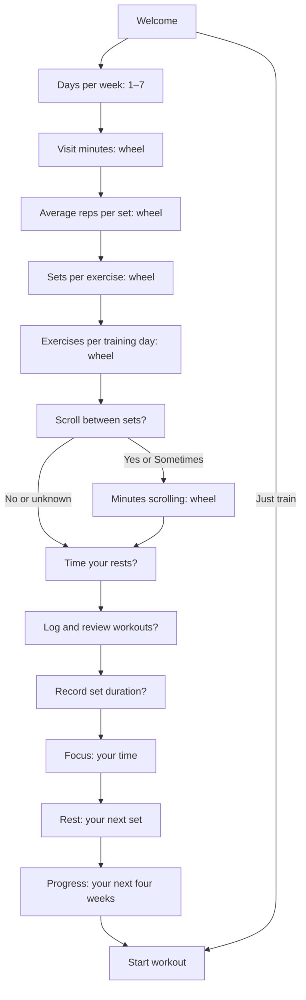

# GymBlock onboarding: one better set, then a month you can see

**Approved design and implementation specification · 3 October 2026**

This proposal responds to the latest frequency-screen feedback and replaces the earlier grouped routine question with the requested sequence. The user approved implementation of this revision. It supersedes [ONBOARDING-REDESIGN-PROPOSAL.md](ONBOARDING-REDESIGN-PROPOSAL.md). See [VALIDATION.md](../VALIDATION.md) for source, simulator evidence and remaining physical-device/user-review limits.

The direction: **quiet questions, tactile answers, then a connected visual story about the person's own training.** The emotional destination is: “I already put effort into the gym. This would help me make that effort easier to repeat, understand and improve.”

The experience should make the value of an ongoing subscription understandable through a useful demonstration. It should not need a sales paragraph, an invented transformation percentage or a promise that a stopwatch builds muscle.

## 1. What changes immediately

1. Frequency becomes one selector containing **1–7 days a week**. Remove the large duplicate number, pencil, rhythm marks and preset pills.
2. Visit duration becomes one inline **haptic wheel**. Remove the separate number, ruler, pencil, preset buttons and editor sheet.
3. Replace “What's a usual workout?” with **three separate picker pages**, in this order: average reps per set → sets per exercise → exercises per training day.
4. Ask about scrolling; if Yes or Sometimes, ask how many minutes they spend scrolling between sets.
5. Then ask about timing rests, logging/reviewing workouts, and recording set duration.
6. Only after those answers, explain attention, rest and progress through three connected scenes.
7. Carry the same visual object across the story: **rep → set → workout → four weeks**. This continuity supplies the sense of journey; input screens remain sparse.

**Navigation assumption:** “Picker only; no buttons” means no extra answer/preset buttons on the duration page. The shared bottom Continue remains a navigation action, outside the answer area. It confirms the settled value and prevents accidental progression while scrolling. No auto-advance on wheel movement.

## 2. Review of the current experience

Review basis: the latest supplied screenshot; the saved native captures in [onboarding-first](../screenshots/onboarding-first/README.md); and `OnboardingJourney.swift`, `OnboardingControls.swift`, `OnboardingFeedback.swift`, `Model.swift` and `Session.swift` at revision `1c0ad2f`. This is a source and recorded-screen review, not a newly run simulator or physical-haptic review.

| Current page or element | Finding | Decision |
| --- | --- | --- |
| Welcome | The centered composition is usable, but the logo assembly is disconnected from everything after it | Keep the sparse composition; let the center bar become the line used later in the story |
| Frequency | One answer appears as a dash, pencil target, unit, seven marks and four preset controls. Values 1, 6 and 7 require a different route | Replace all answer UI with one 1–7 selector |
| Visit duration | The number, pencil, ruler and four presets are three overlapping interaction ideas | One visible wheel, one selected value, one unit |
| Routine | Three values, diagram, combined totals, Varies and Mostly timed compete on one screen | Three distinct pages in the user's requested order; no calculation readout while answering |
| Scrolling question | The short question and simple choices work | Keep; place after all five workout questions |
| Scrolling minutes | Six pills, a custom-entry sheet and the assumption control create another mini-form | One wheel; move assumption editing to the later estimate detail |
| Rest timing | Missing | Add one question; its answer changes the rest scene's emphasis |
| Logging and review | Missing | Add one question with answers that distinguish logging from reviewing |
| Set duration | Missing | Add one question; demonstrate automatic elapsed-time capture later |
| Personal result | The same 34 changes meaning from scrolling to phone-free time. Several labels, scenario buttons, Replay, detail and two footer actions compete | Separate the narrative into focus, rest and progress beats; one hero number per beat, labeled before it animates |
| Ready | “See one set” and “Focus demo” introduce two new decisions after setup | The progress scene already demonstrates a set. End with Start workout; move optional focus setup into options |
| Page transitions | Repeated 150 ms out / 280 ms in fades replace the entire scene, so every page feels like another form | Keep chrome stationary; use continuity between objects and short, sequential question changes |
| Result animation | A one-second bar entrance and 0.7-second comparison work locally, but do not build a beginning, middle and payoff | Retain a truthful fixed-duration comparison inside a broader sequence |
| Sound and haptics | Existing short cues and independent preferences are a useful foundation | Haptics should follow manipulation; reserve sound and stronger feedback for meaningful transitions |

The typography does not need another font. It needs fewer competing roles and more deliberate placement. Keep DM Sans and the red identity.

## 3. The complete route

The longest normal route contains **10 answer pages, a welcome, three explanation scenes and a final action: 15 scenes total**. This is longer than the current route. Keep it feeling light by making answers immediate and retaining Just train. Proposed completion target: 75–110 seconds; measure it, do not advertise it as established.

No/unknown scrolling gets a brief positive focus scene without a loss estimate. Unknown routine answers still permit the rest and logging demonstrations. Every route can reach a workout without supplying all answers.

### Shared question shell

- Stationary back control and options menu. Three quiet progress segments represent **Your training / Your habits / Your next month**. Their fills reflect the actual route; skip optional steps without showing fabricated progress.
- Centered DM Sans medium question, usually two lines or fewer, at 28 points. One answer control beneath it. Body copy is absent unless a question would otherwise be ambiguous.
- One shared Continue, anchored consistently. On picker pages, the selected row is the main number; there is no second hero number above it.
- Options hold Skip this question, Just train, language, sound and haptics. On the reps page, options also hold Mostly timed activity. Keep these reachable and named for VoiceOver.
- Back restores the exact previous answer. Skipped values stay unknown. For first use, a wheel can present a working value, but only Continue confirms it; quitting or skipping does not turn a suggestion into a reported answer.
- Continue commits the nearest settled row. Disable duplicate navigation during the brief handoff, not for the duration of an entire cinematic scene.

### Answer pages: final copy and controls

The ranges below are input bounds, not exercise prescriptions. The ordinary route asks for averages, not exact programming.

| # | Visible question | The only answer control | Range / answer states | Motion and feedback |
| --- | --- | --- | --- | --- |
| 0 | **GymBlock** / **Make your next set count.** | Get started; quiet Just train | No name, account, app list or permissions | The mark assembles once in 650 ms and rests |
| 1 | **How many days a week do you work out?** | One horizontal row: **1 2 3 4 5 6 7**; one selected position | Distinct training days, not visits. No second count, weekday dots or pills. At accessibility sizes use one vertical wheel | A light selection tick. The selection moves; the whole page stays still |
| 2 | **How long is a usual visit?** | One inline minutes wheel | 5–240 minutes in 5-minute steps; initial working value 60. No presets, pencil, ruler, extra input buttons or text field | Native wheel deceleration and selection feedback only |
| 3 | **On average, how many reps per set?** | One inline reps wheel | 1–50; initial working value 10. Varies / Mostly timed in options. Existing ranges stay ranges until explicitly replaced | Same wheel behavior; on Continue the selected numeral briefly condenses to a small mark |
| 4 | **How many sets per exercise?** | One inline sets wheel | 1–20; initial working value 3. Varies in options | Same control; no diagram or rep summary alongside it |
| 5 | **How many exercises on a usual training day?** | One inline exercises wheel | 1–30; initial working value 6. Varies in options | On Continue, a brief transition establishes one workout shape; it does not stay as extra UI |
| 6 | **Do you scroll between sets?** | Three plain choices in one group | Yes / No / Sometimes. Yes and Sometimes open page 7; skipped is a separate unknown state | Selection feedback only; no warning color or judgment |
| 7 | **How many minutes do you scroll between sets?** | One minutes wheel | 0.5–15 minutes, half-minute steps; initial working value 2. Scope: a break in which they scroll | Selection tick only. Asking explicitly about scrolling avoids confusing it with all rest time |
| 8 | **Do you time your rests between sets?** | Three choices in one group | Yes / Sometimes / No | The next transition introduces a small clock mark; no teaching yet |
| 9 | **Do you log your workouts and look back at them?** | Three choices in one group | Log and review / Log only / Neither | A selected answer becomes a small record mark during the transition |
| 10 | **Do you record how long each set takes?** | Three choices in one group | Yes / Sometimes / No | After Continue, the quiet question shell opens into the explanation stage |

This preserves the requested ordering. The new questions are not decorative segmentation: timing answers adapt the rest/time demonstration; logging answers adapt the history demonstration. None produces a fitness score or a judgment that their existing training is ineffective.

For answers outside a wheel's ordinary range, Skip/Varies preserves an unknown value. Existing exact values outside these bounds are retained, not clamped on migration. Exact routine editing remains available later. The onboarding does not need another custom-entry modal.

Choosing Mostly timed activity on page 3 bypasses the three lifting-count answers and goes to the scrolling question. It retains days and duration, then uses qualitative explanations or a supplied actual break count. Choosing Varies for only reps keeps the sets and exercises questions, because those may still have useful averages.

## 4. A story that develops, rather than a slideshow

**Visual motif:** a warm white stage and one fine red line. It can become a rep mark, a group of set marks, a measured rest gap, a workout row and finally four weeks of rows. Material, shape and position connect each transformation. The objects are drawn simply enough to read without motion.

The question pages remain visually quiet. The motif appears briefly during transitions or within the explanation stage, not as an extra dashboard under every picker. After the three routine answers, it suggests a workout without showing a premature arithmetic lesson. The most expressive motion arrives after the habits questions.

### Scene 11 — Focus: “Keep this time for yourself.”

**First composition:** a fixed-length visit strip, with a clearly labeled scrolling region. Example hero: **34 min**; line below: **Estimated scrolling per visit**. Small qualifier: **Based on your answers**.

**Interaction:** press **See the difference**. Gray scrolling marks withdraw; the same space becomes quiet and available. The visit stays the same length. The next composition reads **34 min phone-free** and **Rest stays. Scrolling goes.**

On the longer view, their confirmed weekly frequency builds four rows. The hero resolves to **6 h 48 min** with **Potential phone-free time over 4 weeks** for the worked example below. Show this only when the every-break assumption is appropriate and disclosed. The line **Assuming every break · Adjust** remains adjacent to the estimate; it opens one detail sheet, not more front-page controls.

Sometimes scrolling: the same scene begins with a calm **How many breaks?** wheel replacing the number area. Choose an actual count, then reveal. It is a conditional clarification inside this scene; count it as another answer interaction in usability measurement. If they skip it, show the qualitative comparison without a personal total. Do not treat Sometimes as every break.

No scrolling: **You're already keeping the space between sets.** Show the same clear visit strip without a loss number. Unknown: **Start by noticing your next break.** Neither route is penalized or made to confess a problem.

The visual must not imply that all phone-free minutes are extra exercise, that scrolling erases muscle, or that their visit becomes 34 minutes shorter. Removing distraction and reducing necessary recovery are separate things.

### Scene 12 — Rest: “Give your next set a fair chance.”

Zoom into one gap from the visit strip. It becomes an **upward elapsed counter**, preserving the existing rest-counter product decision. Two set marks remain on either side; recovery space remains visible rather than being squeezed away.

The demonstration shows **0:00 → 2:00**, labeled **Example rest**. This is compressed illustrative time, not a live two-minute wait or a universal target. The motion slows near the settled example so it reads as time being observed. Supporting line: **See the gap. Start when you're ready.** Detail link: **Why rest matters**.

One short detail sheet explains that too little recovery can impair subsequent performance and that evidence does not establish one ideal hypertrophy rest time for everyone. See the research below. No readiness meter, “fully recovered” checkmark, red overdue state or timer-to-muscle percentage.

For Yes: **Keep your rest visible with your sets.** For Sometimes/No: **Let the rest counter start when you finish a set.** Both lead to the same demonstration. The app must not imply a person who rests intuitively is training incorrectly.

The bridge to the next scene shows **set time → rest time → next set**. It establishes what the app can record without asking for another setup preference.

### Scene 13 — Progress: “Make the next workout less of a guess.”

The same set mark opens into a tiny example record: **20 kg × 10 reps · 35 sec**, with **Example** visible. On the next matched exercise, **20 kg × 11 reps** appears beside the earlier record. Highlight **+1 rep at the same weight**. This is a demonstration of comparison, not a prediction for the person.

Then pull back: one record joins a workout; workouts arrange into four week-columns. With the sample routine, the hero becomes **216 sets** and the supporting line **You could have a record of every one.** Small qualification: **Over 4 weeks at your current routine**. A secondary detail can show **12 training days · about 2,160 reps**, but the settled page should still have only one dominant number.

The month view must be prospective: outlined or neutral future entries, never completed checkmarks, earned streaks, a rising physique silhouette or an automatically rising performance chart. The +1 rep example remains explicitly separate from the user's projected logging volume.

Adapt the emphasis: Neither → **Remember what you did.** Log only → **See what changed.** Log and review → **Keep the comparison close to your next set.** Set-time No/Sometimes → demonstrate that Start/Finish can capture elapsed time without additional typing. Set-time Yes → show it alongside reps and load. Duration is context, not a set-quality grade.

This is where recurring value becomes concrete: each real session adds a useful comparison for the next one. Do not stack three invented improvement percentages or convert tracked sets into predicted muscle gain.

### Scene 14 — Handoff: “Your next set starts here.”

The four-week view resolves back to one empty, ready set. One line: **A clear workout. A record to build on.** Primary: **Start workout**. Quiet secondary: **Go to Home**.

Do not display another feature grid, commitment gesture, account wall or forced focus-permission step. Optional focus setup stays available in options. The onboarding demonstration already taught the interaction; remove the separate See one set detour.

Commercial placement is a later decision. If a paid offering is added, it follows the demonstrated value with clear price and terms. This document does not select a price, promise a trial or introduce a paywall to the current prototype.

## 5. Numbers we can stand behind

Use three visibly different kinds of numbers: **Based on your answers**, **Example**, and—only after real training—**Your recorded progress**. These labels belong beside the figure, not solely in a disclaimer sheet.

### Worked personal example

Assume confirmed answers: 3 training days/week, one 60-minute visit on each day, 10 average reps/set, 3 sets/exercise, 6 exercises/day, 2 scrolling minutes on each break.

| Quantity | Arithmetic | Meaning |
| --- | --- | --- |
| Sets per training day | 6 × 3 = **18** | Approximate routine volume |
| Reps per training day | 18 × 10 = **180** | Approximate reps, not guaranteed completion |
| Potential between-set gaps | max(18 − 1, 0) = **17** | Includes gaps across exercise changes; an assumption, not observed rests |
| Scrolling per visit | 17 × 2 = **34 min** | Self-reported scenario; may overlap appropriate recovery |
| Training days in four weeks | 3 × 4 = **12** | Four weeks, not a calendar-month forecast |
| Potential phone-free time | 34 × 12 = **408 min = 6 h 48 min** | If scrolling is removed from those same gaps; visit length is held constant |
| Sets available to track | 18 × 12 = **216** | Prospective records, not extra sets prescribed by the app |
| Reps represented | 180 × 12 = **2,160** | Approximate planned exposure; keep secondary to avoid number overload |

If they scroll on only five breaks, replace 17 with 5: **10 minutes/visit and 2 hours over four weeks**. A half-scrolling scenario is **3 h 24 min** for the full worked example. Keep this secondary scenario in the detail sheet; do not restore a pair of scenario buttons on the main reveal.

The “lost” opportunity we can quantify is attention spent in a feed and training information not recorded. We cannot calculate lost muscle from these answers. We also cannot know their unrecorded performance history; show prospective records rather than “216 sets wasted.”

### Calculation rules and exceptions

- Days/week is not sessions/week. Store it separately from the old visits answer. Disclose the one-visit-per-training-day assumption before displaying visit-based four-week totals; if it does not fit their routine, omit those totals until clarified in the estimate detail. Preserve old visits, even above seven.
- `N = averageExercises × averageSets`; estimated gaps `B = max(N − 1, 0)`; actual supplied scrolling breaks `K` overrides B. `P = K × scrollingMinutes`; four-week projection `4 × days × P` only with the visit assumption confirmed or clearly accepted in the estimate view.
- Supersets, circuits, exercise changeovers and different daily routines can make B inaccurate. The detail sheet permits K and explains its scope. It is not a prescribed rest count.
- Scrolling minutes support fractions. “More than five” cannot silently become five. Unknown/varied values do not become zero or working defaults.
- If P exceeds visit duration, show a quiet correction route and a qualitative scene meanwhile; never cap the number or call the user dishonest. Equality also warrants review because it leaves no time for the workout; it is not evidence of zero exercise.
- If values are missing, show the truthful subset: sets without reps, per-visit time without weekly frequency, or the example only. Timed activity bypasses reps/sets estimates that do not apply.
- Recorded weight moved is the sum of each logged load × its actual reps. Survey reps alone cannot generate a workload total because load is unknown. Workload is not equivalent to strength or muscle gain.
- Like-for-like progress compares the same exercise and relevant split, reps at the same load or load at the same reps. A 10→11 rep example is one additional rep, not 10% more muscle.

## 6. Research report: what the story can honestly teach

Research checked on 3 October 2026. This is a focused product evidence review, not a new systematic review. Studies of training protocols or general goal monitoring do not establish GymBlock's efficacy. App copy below is our proposed interpretation, not quoted study text.

| Question | Evidence and limits | Product decision |
| --- | --- | --- |
| Does rest duration matter? | A 2024 review of nine studies found a possible small hypertrophy advantage above 60 seconds, substantial uncertainty, and no appreciable detected difference beyond 90 seconds. That is not proof that 90 seconds is optimal. [Singer et al.](https://pmc.ncbi.nlm.nih.gov/articles/PMC11349676/) | Explain recovery; do not declare one ideal timer setting |
| Can we show a real numeric comparison? | In an eight-week trial of 21 trained young men, 3-minute rests outperformed 1-minute rests for squat/bench strength and anterior-thigh thickness; the triceps difference was a trend. It tested rest protocols, not an app or timer versus intuition. [Schoenfeld et al., 2016](https://pubmed.ncbi.nlm.nih.gov/26605807/) | The detail sheet may cite “1 vs 3 minutes, 8 weeks.” Do not turn this into “three times the gains” |
| What does newer guidance say? | The 2026 ACSM overview synthesized 137 reviews. It judged hypertrophy evidence for inter-set rest insufficient and emphasized progressive resistance training; time under tension did not consistently alter outcomes. Its broader methodology differs from the focused rest review. [ACSM position stand](https://pmc.ncbi.nlm.nih.gov/articles/PMC12965823/) | Keep the main promise practical: make time visible and comparisons easier. Do not market an “optimal rest algorithm” |
| Does recording progress help? | A meta-analysis of 138 experiments, 19,951 participants, found a goal-attainment effect of d = 0.40; recording progress strengthened effects. These were diverse goals, not a one-month muscle-growth trial. d = 0.40 is not 40% improvement. [Harkin et al., 2016](https://pubmed.ncbi.nlm.nih.gov/26479070/) | Demonstrate remembering and reviewing actual performance; no claim that logging alone accelerates hypertrophy by a quantified amount |
| Does timing every set create more growth? | Eight studies in a repetition-duration review found similar hypertrophy over roughly 0.5–8 seconds per repetition. Timing a complete set is also different from measuring individual-rep tempo or muscular tension. [Schoenfeld et al., 2015](https://pubmed.ncbi.nlm.nih.gov/25601394/) | Treat elapsed set duration as context. No “35 seconds is ideal” or time-under-tension score |
| Can we claim scrolling reduces gains? | A small crossover experiment found lower squat volume-load after 30 minutes of social-network use in 16 recreationally trained adults. Another, with 12 trained adults, found no effect on its measured internal training load/cognitive outcomes before or during training. Protocols and outcomes differ. [Gantois et al., 2021](https://pubmed.ncbi.nlm.nih.gov/34000894/), [Fortes et al.](https://pubmed.ncbi.nlm.nih.gov/33372542/) | Evidence is insufficient for a per-minute muscle penalty or a GymBlock transformation forecast. Quantify their reported scrolling time instead |

**Recommended visible claims:** “Keep your rest in view.” “Know what you lifted last time.” “See another rep at the same weight.” “Build a record of your next four weeks.”

**Exclude:** “Tracking makes you X% bigger.” “Every scrolling minute costs muscle.” “All breaks beyond two minutes are wasted.” “Your optimal set takes 40 seconds.” “Gain X lb with GymBlock.” A combined effectiveness score would disguise the same unsupported assumptions.

The ambition remains physical progress. The persuasive link is concrete: attention stays with training, elapsed time is visible, completed work is remembered, and the next session has a useful reference. Any numerical body-transformation claim would require evidence that directly supports that specific claim.

## 7. Animation direction and timing

These timings are design hypotheses to prototype. The cinematic quality should come from continuity, pacing and a clear change in meaning—not longer waits.

| Beat | Direction | Proposed timing | Sound / haptic | Reduced Motion |
| --- | --- | --- | --- | --- |
| Welcome | Bar and plates find their final alignment; no repeating bounce | 650 ms, once | Optional soft resolve | Final mark immediately |
| Picker movement | Value follows the finger, decelerates and snaps | Native behavior | System selection feedback; do not add a duplicate pulse | Native accessible selection |
| Question handoff | Keep chrome fixed; old title leaves before new title appears. Answer area shares its center anchor | 120 ms out + 180 ms in | Usually silent | 100–150 ms fade or instant |
| Reps → sets → exercises | A small trace of the previous answer becomes the next shape during the handoff, then clears | 250–350 ms | At most one quiet settle | Direct replacement |
| Questions → explanation | Workout trace expands into the visit strip; background warmth deepens slightly | 700–900 ms | One soft arrival | Static strip and title |
| Scrolling reveal | Identify the gray portion first; then remove the feed marks while keeping the visit scale fixed | 1.8–2.4 sec | One restrained release cue; no buzzing per minute | Labeled before/after crossfade |
| Rest scene | Focus moves into one gap; elapsed example resolves to 2:00 | 1.4–1.8 sec, visibly an example | A soft tick at the endpoint, not a real rest alarm | Example 2:00 displayed at once |
| Set record | One example record gains a comparison; highlight the changed rep count only | 1.2–1.6 sec | One selection pulse | Side-by-side values |
| Four-week payoff | Records organize into four columns; prospective set count settles | 1.8–2.4 sec | One short tonal resolution | Four labeled columns immediately |
| Start workout | One prospective set becomes the real empty-session starting point | 300–450 ms | Existing action feedback | Immediate navigation |

### Storyboard for the main reveal

1. **Recognition, 0–0.4 s:** the visit strip is already readable. The scrolling portion and label become the focal point; no number is racing yet.
2. **Consequence, 0.4–1.2 s:** its small feed marks gather into the scrolling-time figure. Their space remains visible, so the user understands where the number came from.
3. **Possibility, 1.2–2.0 s:** the marks withdraw; the same strip becomes phone-free without compressing rest. The qualifier remains steady.
4. **Scale, on the next deliberate action:** a single visit organizes into four weekly rows, then settles to the four-week total. Do not force the per-visit and four-week numbers to compete at once.
5. **Continuity:** the next page starts from a gap already present in that strip. Later, the same marks become records. No unrelated stock illustration or abrupt new metaphor.

Tap Continue during a reveal to settle it and move on. Back restores a readable state without replaying the entire sequence. Replay belongs in options. Pause/cancel all queued sound and motion on backgrounding or leaving the scene. Returning should not launch a surprise fanfare.

The metaphor must remain consistent: red means the person's training/focus, neutral gray denotes other time. It never indicates a physiological recovery percentage. Count marks represent counts; spacing is schematic unless explicitly time-scaled.

### Design research behind this direction

- Apple advises predictable ordered picker values and keeping pickers in context. Its general guidance favors other controls for short lists; that supports the compact 1–7 row while wheels serve the longer numeric ranges. [Apple: Pickers](https://developer.apple.com/design/human-interface-guidelines/pickers)
- Apple frames motion as purposeful feedback and says people should be able to cancel it. The long reveals remain optional and readable statically. [Apple: Motion](https://developer.apple.com/design/human-interface-guidelines/motion)
- Standard controls can provide built-in haptics; Apple recommends consistent, brief and optional tactile feedback. Verify actual native behavior before adding custom pulses. [Apple: Playing haptics](https://developer.apple.com/design/human-interface-guidelines/playing-haptics)
- Liquid Glass belongs in the functional control/navigation layer. Keep the timeline and records clear in the content layer, with no glass stacked over glass. [Apple: Meet Liquid Glass](https://developer.apple.com/videos/play/wwdc2025/219/)
- Duolingo's animation team describes iterating transformation, timing and rhythm before polishing. Apply that process to one connected GymBlock sequence; do not borrow its mascot, celebration intensity or conversion assumptions. [Duolingo: Animating the streak](https://blog.duolingo.com/streak-milestone-design-animation/)

Apple's Motion and Pickers guidance was also read through its official documentation JSON because the normal pages require JavaScript. No external app onboarding was freshly installed or tested for this proposal.

## 8. Visual and accessibility contract

Keep the existing DM Sans family. Use 28-point medium questions, 44–56-point selected values where the native/custom control supports them, 15–17-point units and brief context. At standard text size: one headline, one answer object, one navigation action. The evidence scenes may add one source/detail link and one short qualifier. Avoid typography that requires shrinking to fit.

Warm white stays mostly still. A low red warmth builds across the narrative and settles when training begins. Deep red is the functional accent, with legible ink and a separate dark palette. No blue, floating emoji, testimonial cards, scattered particles or full-screen red flash. Native glass is restrained to controls; the wheel does not need a glass card around it.

Give the number selector a real 44-point minimum interaction target. At large text sizes, the seven-day row becomes one accessible wheel rather than squeezing seven tiny targets. Long questions wrap; pages scroll only when necessary. The selected value has a spoken unit and adjustable actions. VoiceOver announces the settled answer/result, not every intermediate animation number.

Reduce Motion provides the full meaning without zooms, rolling counters or object travel. Reduce Transparency uses opaque controls. Increased Contrast preserves text/selection legibility. Haptic and sound toggles remain independent; respect Silent mode and audio already playing. Do not layer app haptics over the wheel's system feedback or imply the app can override a user's device-wide settings. A muted/reduced-effects route must feel complete.

## 9. Product work required to earn the narrative

The document is a design proposal, but the eventual implementation must deliver what its demonstration teaches.

| Capability | Current evidence | Required before making the proposed promise |
| --- | --- | --- |
| Reps/load logging and history comparison | Present; History has records, reps and workload views | Preserve existing correction, split and unit behavior |
| Upward rest counter | Present during a live session | Keep count-up behavior; do not convert this into a countdown requirement |
| Historical set duration for rep exercises | `setStarted` exists live; `logSet` stores `minutes = 0` for ordinary rep sets | Persist separate optional elapsed-set time. Keep timed-activity duration semantics intact; do not backfill old sets with invented timings |
| Historical rest intervals | The current session rest timestamp is cleared when the next set starts | Capture elapsed gap before clearing it and associate the two set IDs. Distinguish across-exercise gaps; preserve corrections and deletion |
| Automatic capture | Existing Start/Finish interactions can provide timestamps | No new logging taps. Label it elapsed Start-to-Finish time, not measured muscular tension. Allow forgotten-stop or interrupted intervals to be corrected/marked unknown |
| Four-week report | Existing charts offer useful building blocks | Make the promised comparison accessible and use recorded data only; handle flat/downward results without hiding them |
| Focus | Explicitly simulated | Keep prototype copy honest. Actual selected-app restrictions require separate implementation and verification before production claims |
| New survey data | Current baseline uses visits and an integer minutes field | Version optional fields for training days, fractional scrolling minutes and the three new habit answers. Preserve existing history and earlier answers |

Ending, switching exercises, adding a missed set, cancelling a set, app suspension and forgetting to press Finish all need timing rules. A manually entered past set has unknown duration unless supplied. A long idle gap is not automatically physiological rest. The onboarding's cinematic example must never save a workout or achievement.

## 10. Implementation sequence and acceptance

**First: settle the interaction.** Build the 1–7 selector and one reusable haptic numeric picker. Replace the grouped routine question with the three pages. Add the habit questions and branching. Validate all answer/resume paths before investing in animation polish.

**Second: make the numerical story reliable.** Separate days from visits, add fractional scrolling time and actual-break overrides, implement missing/invalid paths, and preserve migrations. Create fixed example data that can never enter real History.

**Third: prototype the connected motion.** Start with a gray/red storyboard of the three explanation scenes. Compare the connected transformation with a simple before/after crossfade using identical wording and values. The selected direction remains before/after; the comparison tests how it is presented, not whether to replace it with a new chart type.

**Fourth: fulfill the timing and report promises.** Add reliable set/gap persistence and correction behavior before the onboarding advertises automatic timing history. Finish sound/haptic tuning on a physical iPhone and review each page in context.

### Acceptance checklist

- Frequency exposes every value 1–7 in one control. Duration has one wheel and no extra answer buttons. Reps, sets and exercises appear on distinct pages in the requested order.
- Habit questions appear after workout questions and before explanation. Every answer affects the appropriate narrative or is not collected.
- No/unknown/Sometimes scrolling, varying routines, timed activity, one set, fractional minutes, supersets and multiple daily visits have truthful paths.
- The sample arithmetic produces 34 minutes/visit, 408 minutes/four weeks and 216 prospective sets; five actual scrolling breaks produces 120 minutes/four weeks. No percent-muscle conversion exists.
- The visit does not shrink when scrolling disappears. Every chart has an explicit meaning, time basis and provenance. Rest is not depicted as waste.
- Normal, small-screen, dark, large-text, increased-contrast, Reduce Motion/Transparency and manual VoiceOver routes remain readable and operable.
- Rapid taps, wheel deceleration, Back, backgrounding, relaunch and interrupted animation preserve answers and cancel pending feedback. A working picker default is never silently reported as an answer.
- The three reveal scenes can be skipped, replayed and understood without motion or sound. No compulsory cinematic delay blocks training.
- Sample/example records never enter History. Timing records survive real session transitions and retain unknown values honestly.

### Friend review before calling it polished

Run five short, observed sessions as a directional usability check, not a conversion experiment. Include a new lifter, an experienced logger, a non-scroller, someone with variable/timed workouts and a participant who uses larger text/reduced motion where available. Do not collect covert analytics.

Ask each person to set their routine, change an answer, explain the scrolling number, explain whether rest was shortened, and start a workout. Then ask what the app would help them do tomorrow. Record completion time, hesitation/backtracking, number comprehension and whether the animation helped or delayed them. Finish with “Would you choose the connected animation or the quieter comparison?”

Success means they can describe the value in their own words and use the first workout immediately. Treat any belief that the app guarantees extra muscle, that rest is wasted, or that example records are their own results as a design failure to correct. Subscription value should emerge from a believable, useful product experience.
