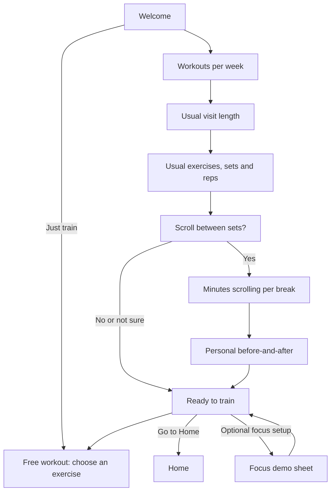

# GymBlock onboarding — workout first, then focus

**Approved design · 3 October 2026 · Implemented in the native prototype**

Build the onboarding around a person’s workout: understand their routine, let them recognise their scrolling habit, then show one clear before-and-after comparison. Use Speaking Coach’s actual onboarding composition—centered questions, a single visual focus, tactile glass controls and carefully timed reveals—with GymBlock’s red identity.

The current screen order and layouts should be replaced, not given another layer of decoration. This document specifies that replacement. The user approved implementation after this proposal. This is now the current onboarding specification, replacing the earlier sequence in `REDESIGN-PLAN.md`. Implementation evidence and remaining validation limits are recorded in `VALIDATION.md`.

## 1. What is going wrong

The two supplied screenshots show a composition problem as well as a copy problem.

| Current choice | Why it feels wrong | Proposed change |
| --- | --- | --- |
| Wordmark, large icon, two-line heading, paragraph, language, name, helper copy and two actions on the opening screen | The first impression is a questionnaire with several competing focal points | One centered brand composition, one short line and Get started |
| Social-media questions immediately after welcome | We introduce the problem before understanding why the person came to the gym | Workout questions first; scrolling after their routine |
| Large left-aligned headings on every page | We borrowed Speaking Coach’s Home layout instead of its onboarding layout | Centered 28-point medium-weight questions, with the answer below |
| White cards wrapping labels, text boxes and preset chips | Several layers explain and edit the same value | A large directly editable value and one control, on the page itself |
| Decorative symbol above every question | Repetition without explaining anything | Replace most symbols with a visual that responds to the answer |
| Persistent dots, heavy surfaces and a strong button glow | The background and containers compete with the question | A quieter warm stage, restrained texture and native glass on controls |
| More numbers and explanatory text on the result page | The user has to work out the benefit | One animated comparison, one large result, one short qualification |
| Generic bouncing symbols and whole-page slides | Motion adds activity without giving the sequence a clear rhythm | Gentle page fades; stronger motion reserved for the personal reveal |

Reference images, preserved without alteration:

| Current GymBlock | Speaking Coach reference |
| --- | --- |
| [Supplied welcome](onboarding-references/gymblock-current-welcome.png) | [Welcome composition](onboarding-references/speaking-coach-welcome.png) |
| [Supplied duration page](onboarding-references/gymblock-current-duration.png) | [Centered question and glass answers](onboarding-references/speaking-coach-question.png) |

The answer is not simply smaller text. Remove redundant content, give each screen one focal point, and make the person’s input visibly change something.

## 2. What we should learn from Speaking Coach

I inspected its native source at local revision `f565354`, plus saved welcome, category, demo and plan captures. Those captures are reference artifacts; this review did not run a new Speaking Coach onboarding session.

| Observed pattern | GymBlock adaptation |
| --- | --- |
| `QuestionLayout`: centered 28-point question, control in the middle, live consequence beside the control | Stable alignment for questions, numbers and readouts; standard-size screens should usually sit still |
| DM Sans with deliberate weight and optical size | Keep the font; use weight 500 for questions, 600 for the main number and 400 for supporting text |
| `MorningStage`: a warm background changes gradually with the story | A quiet warm-white stage with a restrained red warmth near the bottom; strongest at the personal reveal |
| `GlassSurface`, `GlassGroup`, `OptionRow`: native material, tactile press and clear selected state | Glass on choices, back and primary action; selection also has a checkmark or outline |
| Questions alternate with recognition, demonstration and a personal plan | Workout input → scrolling recognition → visual comparison → next workout |
| Page content fades out before the next page appears: 150 ms out, 300 ms in | Adopt the sequential fade. Do not show two question pages on top of one another |
| Staged reveals and a tappable example | A personal time comparison and an optional example of logging a set |

**Do not copy its entire funnel.** Speaking Coach has a longer emotional narrative, name entry, account steps and a commitment gesture. GymBlock should keep its direct route to training. Its 900 ms forward-settle delay and word-by-word haptics are also unnecessary here; prevent accidental double taps only while a transition is in flight.

Local source references: [Question layout](../../Speaking%20Coach/SpeakingCoach/DesignSystem/Scaffold.swift), [typography](../../Speaking%20Coach/SpeakingCoach/DesignSystem/Typography.swift), [glass](../../Speaking%20Coach/SpeakingCoach/DesignSystem/Glass.swift), [background](../../Speaking%20Coach/SpeakingCoach/DesignSystem/MorningStage.swift), [flow](../../Speaking%20Coach/SpeakingCoach/Onboarding/OnboardingFlow.swift), [reveal behaviour](../../Speaking%20Coach/SpeakingCoach/Onboarding/StepChrome.swift). These sibling-project links are for the local workspace; the copied images above remain portable.

## 3. Research that informs the proposal

Research reviewed on 3 October 2026. These are documented patterns and design references, not evidence that a particular flow will improve GymBlock’s conversion. No fresh-install audit of the external apps or controlled usability study was performed.

| Source | Relevant finding | Our design decision |
| --- | --- | --- |
| [Apple — Onboarding](https://developer.apple.com/design/human-interface-guidelines/onboarding?changes=_7) | Keep onboarding brief and optional; teach through interaction and postpone nonessential setup | Keep Just train available; defer name, split building and detailed exercise exceptions |
| [Apple — Meet Liquid Glass, especially Principles at 10:31](https://developer.apple.com/videos/play/wwdc2025/219/) | Glass establishes a control/navigation layer; avoid glass-on-glass and excessive tinting | Use regular native glass for interactive controls; keep illustrations and numerical comparisons in the content layer |
| [Apple — Motion](https://developer.apple.com/design/human-interface-guidelines/motion) | Motion should have a purpose, respond naturally and allow people to continue without waiting | Short feedback, interruptible reveals and a complete static alternative |
| [Structured — Web 1.0 onboarding](https://structured.app/blog/structured-web-1-0) | Its documented web onboarding uses a short tutorial and custom illustrations to introduce key features; it was refined through user feedback | Give GymBlock a recognisable workout illustration and test comprehension, rather than adding generic icons. This is a web reference, not a claim about its current iOS flow |
| [Hevy — starting a workout](https://help.hevyapp.com/hc/en-us/articles/35361530647959-How-to-Log-a-Workout-in-the-Hevy-App-Step-by-Step-Guide) | Empty workouts and saved routines are both direct entry paths | No mandatory split creation during onboarding; the final action can begin a free workout |
| [Duolingo — streak animation](https://blog.duolingo.com/streak-milestone-design-animation/) | The team iterated timing and visual transformation around a meaningful milestone | Reserve the largest animation for the moment their own numbers become understandable |
| [Duolingo — interactive math visuals](https://blog.duolingo.com/developing-math/) | Visuals respond to programmatic inputs, including with Rive | The animation should reflect actual answers. Our simple timeline can remain native SwiftUI; a new animation dependency is not needed |
| [Duolingo — shape language](https://blog.duolingo.com/shape-language-duolingos-art-style/) | Simple shapes and negative space can carry personality and direct attention | One consistent family of workout marks; avoid unrelated decorative artwork on each page |

Apple’s motion page was also read through its official documentation JSON because its normal page requires JavaScript. The precise timings below are proposed GymBlock values to test, not numbers prescribed by Apple.

## 4. Proposed journey

**Welcome → Your workouts → Your scrolling → Your possible change → Start.**

Eight main scenes on the complete lifting/scrolling path. The routine scene contains three related values, so scene count must not be confused with number of answers. No-scrolling and unknown paths are shorter. Aim for a 45–75 second complete setup; this is a design target to measure, not a validated completion time.



### Scene 0 — A clean welcome

**Visible copy:** `GymBlock` · `Stay with your workout.`

**Primary:** `Get started` · **Secondary:** `Just train`.

A centered 104–120-point brand mark, wordmark and one line. The mark assembles once from simple weight/bar shapes, then rests. No paragraph, name field, language card or “No account needed” helper. A small options menu offers language, sound and haptics; choose the device language by default. Name remains editable in Settings.

Just train ends setup and opens free-workout exercise selection with focus disabled. It must not seed demo history or pretend that unanswered questions have answers.

### Scene 1 — Their weekly rhythm

**Question:** `How often do you work out?`

One large value with `workouts / week` beneath it. A compact tactile selector changes the value; tapping the number allows a manual value. Show an unanswered state initially, not an already-confirmed frequency. Keep `Not sure` as the quiet secondary action.

A small row of workout marks grows with the selected count. These represent visits, not specific weekdays. Do not request a calendar schedule.

**Primary:** `Continue`.

### Scene 2 — Their time at the gym

**Question:** `How long is a usual visit?`

One central minute value and a horizontal ruler with familiar stops such as 30, 45, 60 and 90. Tap the number to type; custom values remain supported. The current visible text box, Minutes label and separate white card disappear. A restrained line expands with the selected duration.

**Primary:** `Continue` · **Secondary:** `Not sure`.

The input means total visit time. Do not infer lifting time, optimal rest or seconds per rep from it.

### Scene 3 — A picture of their routine

**Question:** `What’s a usual workout?`

This is the one deliberate grouped-input scene: exercises, sets per exercise and reps form one mental object. Use a single workout sketch, with three clearly labeled, directly editable values beneath it: `Exercises`, `Sets each`, `Reps`.

No card around each input and no always-visible keyboard. Tapping a value opens one compact native editor with quick choices and manual entry. Only one editor is open at a time. At large text sizes the values stack. Unanswered values show a dash and remain unknown; do not quietly commit a stock 5 × 3 × 10 routine.

As exercises and sets are chosen, the sketch forms columns of set marks. Once reps are supplied, a quiet readout can show `18 sets · 144–216 reps`. The marks encode counts only, not fabricated set durations. Large counts use a summarized drawing with an exact numeric label rather than hundreds of marks.

Support a rep range. `Varies` and `Mostly timed` are secondary routes: keep detailed per-exercise/per-set setup in the later routine editor. If set counts are unknown, continue without a personalized time total. Timed activity should not be forced into rep questions.

**Primary:** `Continue` · **Secondary:** `Not sure`.

### Scene 4 — Introduce the scrolling habit

**Question:** `Do you scroll between sets?`

This short wording preserves the meaning of “Do you scroll through your phone in between sets?” while removing unnecessary words.

Three full-width glass answers: `Yes`, `No`, `Not sure`. One selected state and one Continue button. No app logos, guilt statement or paragraph about doomscrolling.

Yes opens the minutes scene. No skips the time-loss narrative entirely. Not sure offers a usable app without an invented estimate. The app can invite them to observe their next workout later.

### Scene 5 — Estimate scrolling, not the entire rest period

**Question:** `How much of each break is scrolling?`

Five compact choices: `1 min`, `2 min`, `3 min`, `4 min`, `5 min`, plus `More` for manual input. One selected value. At larger text sizes use two columns with whole, unbroken labels.

One small assumption line: `Assuming every break · Edit`. Edit lets them enter how many breaks they actually scroll in; this is optional disclosure rather than another mandatory page. An unedited assumption is retained as an assumption in the result.

**Primary:** `Show me` · **Secondary:** `Not sure`.

Do not show the arithmetic paragraph here. The next scene owns the reveal. If an estimate cannot fit within their stated visit, show one inline message with direct Edit time / Edit routine actions. Never silently reduce the result.

### Scene 6 — The personal before-and-after

**First state:** a large `34 min` with `scrolling per workout` and the small qualifier `Based on your answers`.

One horizontal workout timeline shows that estimated share of their stated 60-minute visit. The user taps `See the difference` to transform it into a possible phone-free scenario.

**Second state:** a large `34` with `more phone-free minutes` and `If you skip scrolling between sets.`

The same timeline retains its outer length while the scrolling segment becomes phone-free time. Necessary rest remains included. A quiet secondary line may show `102 min across your 3 weekly workouts`. Do not display several equally large statistics or launch another chart underneath it.

`Half as much` / `No scrolling` can adjust the scenario in a small glass control. No scrolling is a proposal until the person explicitly chooses `Use this goal`; `Continue without a goal` remains available. Replaying or dragging the comparison never writes an achievement to History.

`How this is estimated` opens the formula and editable assumptions. The summary itself should remain readable without opening it.

When the required inputs are missing, bypass the numeric reveal. Do not use example numbers in a personalized result. A labeled example may appear only if they deliberately request an example.

### Scene 7 — Give them a next action

**Headline:** `Ready for your next set.`

**Primary:** `Start workout` · **Secondary:** `Go to Home`.

Keep free workout as the direct start; do not require building a split or naming a routine. An optional `See one set` demonstration can show the log-and-rest interaction without saving a workout. Its values are explicitly labeled Example.

Offer focus setup only here, after the benefit is understood. In the present prototype it opens a clearly labeled **Focus demo** sheet. App-category questions belong in that optional sheet, not the beginning of onboarding. Actual installed-app selection and Screen Time permission belong to a future real blocking integration; they must not be represented as already working.

Finishing setup alone never starts a hidden workout. Start workout does; Go to Home does not.

## 5. Visual direction and content budget

### Composition

- A stable top row: 44-point glass back control, quiet continuous progress indicator, 44-point options control. No repeated oversized symbol below it. Welcome uses the same alignment without showing a progress bar.
- One centered question, one central interactive object and one bottom primary action. Readouts belong close to the value they explain.
- Keep 24-point horizontal margins and a 56–60-point primary button. Let content flex vertically between header and bottom action; do not fix the layout to one simulator height.
- At normal type size, keep the default state of each question on one screen. Scroll only when content or accessibility sizing needs it; controls must never sit hidden behind the bottom action.

### Type and colour

| Role | Proposal |
| --- | --- |
| Questions | DM Sans 28 pt, weight 500; centered; normally one or two lines, allowing three for the scrolling question |
| Main numeric value | DM Sans 64–76 pt, weight 600; stable-width digits; smaller baseline-aligned unit |
| Answer labels and primary action | 16–17 pt, weight 500 |
| Supporting line | 14–15 pt, weight 400; usually under ten words |
| Core colours | GymBlock red `#C92535`, warm ink `#231A1B`, warm-white ground beginning around `#FBF8F5` |
| Background development | A very faint warmer tint near the lower edge, tested around `#F5E6E4`; independent dark-mode palette required |

These are starting tokens for visual validation, not a completed contrast audit. Preserve Dynamic Type and optical-size handling. Never make a paragraph fit by shrinking it to caption size or clipping it.

Use a quieter version of Speaking Coach’s warm stage. Remove GymBlock’s conspicuous uniform dot grid from onboarding; if subtle grain helps the glass read, keep it static and nearly imperceptible. The background should settle when a page settles.

Use real regular Liquid Glass on navigation, answer controls and the red primary action. Leave the large number and workout diagram directly on the background. No nested glass cards, extra glossy borders or opaque paint on top of native glass. Keep selection distinct through shape/checkmark as well as colour. Below iOS 26, use the existing native/material fallback without pretending to reproduce every glass effect.

For the primary action, inspect Speaking Coach’s tinted regular-glass capsule style directly: its press response and material edge are part of the reference. Any adapted button style must visibly reflect disabled and pressed states and keep the whole capsule tappable.

**Default copy budget:** one question; at most one short supporting line; short answer labels; one primary action. Put formulas, qualifications beyond the essential assumption, and detailed routine editing behind clearly named disclosure. Errors appear only when relevant. Repeated “Optional,” “No account needed” and “From starting to finishing…” explanations should disappear.

## 6. Animation direction

The recommended first treatment is **A: the same workout, before and after**. It ties the effect to the person’s own workout and makes the arithmetic easier to understand. B and C are alternatives for comparison during design review, not three animation styles to ship together.

| Treatment | Visual sequence | Strength | Risk / decision |
| --- | --- | --- | --- |
| **A — Workout timeline transformation** | One fixed-length visit timeline; an estimated scrolling segment is revealed, then changes into possible phone-free time | Direct relationship between input and result; visually quiet | Label the time clearly so it is not mistaken for a guaranteed shorter visit. Recommended |
| **B — A week of workouts** | One timeline becomes three small visit marks; their scrolling minutes collect into one weekly total | Makes repeated small amounts feel tangible | Adds a scale change and can overemphasize a large number. Use only with known weekly frequency |
| **C — Before-and-after scrub** | The user drags a small comparison control; the same timeline interpolates between current scrolling and the chosen goal | Strong sense of agency; easy to replay | More interaction to discover. A tap alternative and VoiceOver-adjustable control are required |

### Recommended reveal storyboard

```text
BEFORE                         POSSIBLE GOAL
60-minute visit                Same 60-minute reference
[ phone-free 26 | scroll 34 ]   [ phone-free 60             ]
            34 min                         +34 min
      estimated scrolling             possible phone-free time
```

The diagram is content, not a glass container. Never imply that the non-scrolling portion is all active lifting; it includes rest, transitions and other activity. Red can mark the possible gain while the original scrolling portion uses neutral fill and a distinct pattern/label.

### Motion and feedback specification

| Event | Proposed behaviour | Feedback / interruption |
| --- | --- | --- |
| Welcome | Simple brand-mark assembly, about 450–650 ms, then still | No automatic sound on launch; Get started remains usable |
| Page change | 150 ms fade out, swap, 250–300 ms fade in | No overlapping pages. Block duplicate activation only during the transition |
| Answer selection | Native glass press; selected mark settles in 150–200 ms | One light selection haptic; do not auto-advance |
| Numeric editing | Short 180–250 ms numeric transition | Haptic at a discrete selection, not continuously for every pixel |
| Routine sketch | Set marks respond to the chosen counts, about 200–300 ms | Exact text equivalent; no implied rep speed |
| First result | Timeline appears, estimated segment resolves, number settles; total about 900–1,200 ms | One subtle endpoint cue; all information available without waiting |
| Before → possible goal | Same outer geometry, changed segment and numeric delta over 600–800 ms | A single soft completion cue; tappable Replay, no infinite loop |
| Background | Low-amplitude warmth change between story stages, about 600–900 ms | No constant breathing, parallax or moving particles behind questions |
| Returning to a page | Restore the chosen value immediately | Do not replay the entire celebration or make the user wait again |

A short count-up alone is insufficient: the shape must explain what the number represents. Avoid typewriter paragraphs, confetti after ordinary answers, rotating 3D trophies, repeated SF Symbol bouncing and arbitrary loading bars saying a plan is being generated.

Sound stays optional and brief. Selections mainly use haptics; one soft cue can mark the personal reveal. Respect Silent mode and other audio, keep the existing independent sound/haptic preferences, and avoid feedback on every animated digit. Native material response should provide most of the tactile character.

With Reduce Motion, show the final diagram and values immediately or through a short opacity change. Preserve every label and control. Reduced Transparency uses legible opaque/frosted surfaces; increased contrast must keep the selected option clear. Important information must never depend on hearing a cue or seeing a morph.

## 7. What the numbers may say

Use the person’s supplied values and label the result as an estimate. For the common lifting case:

```text
N = known total sets
B = max(N − 1, 0) available between-set gaps
K = supplied scrolling breaks, or B when using the explicit every-break assumption
M = minutes scrolling in each of those breaks
W = workouts per week, when supplied

Estimated scrolling per workout S = K × M
Estimated scrolling per week    = S × W
Scenario gain with target M′     = K × max(M − M′, 0)
```

Example: 6 exercises × 3 sets = 18 sets; 17 gaps × 2 scrolling minutes = 34 minutes per workout; three visits = 102 minutes per week. Cutting scrolling to one minute gives a **17-minute phone-free scenario per workout**. Stopping scrolling gives **34 minutes**. Both are scenarios until observed, and both can include necessary rest.

| Situation | Required behaviour |
| --- | --- |
| No scrolling | Save the answer and skip the loss/goal reveal; no attempt to manufacture a problem |
| Missing counts or minutes | No personalized number; continue to training |
| Unknown weekly frequency | Per-workout estimate only |
| One set | Zero between-set gaps; no dramatic zero-minute celebration |
| Some breaks only | When B is known, K must be within 0…B; do not multiply by all breaks after they edit this assumption |
| Supersets or back-to-back sets | Let the person supply their actual scrolling-break count; not every gap between sets is a rest break |
| Different exercise set counts | Use the sum if supplied; otherwise mark the typical-count assumption |
| Timed or mixed routine with unknown breaks | Do not invent a rep-derived total; allow a supplied break count or skip the estimate |
| Estimate exceeds total visit time | Ask for a correction or allow the estimate to be skipped; never silently cap it |
| More / manual values | Validate the value without blocking navigation away; preserve entered text through corrections |
| Back changes earlier answers | Recalculate from saved inputs; invalidate an incompatible goal; never display stale personal totals |
| Relaunch or older onboarding data | Preserve answers and workouts; use stable step identifiers and migrate old step indices |

“Minutes lost” is useful as a design motivation, but the visible claim should be **estimated scrolling time**. Do not equate all rest with waste, turn it into a guaranteed earlier finish, or forecast pounds of muscle/fat change. The concrete gains this onboarding can show are a chosen phone-free-time scenario and the ability to track actual reps, sets and load × reps later.

## 8. Implementation plan, after this design is accepted

1. **Approve three key compositions first:** welcome, duration input and before/after result. Review them together against Speaking Coach at normal and large text sizes. These should establish the visual system before building the remaining questions.
2. **Create the onboarding scaffold:** centered title/control/readout layout, stable bottom action, correct native glass and a quiet warm stage. Limit this change to onboarding so the workout interface does not drift with it.
3. **Implement the workout-first route and saved draft:** reorder duration/frequency/routine before scrolling; defer name/app categories; preserve skip and return paths. Add optional scrolling-break count and distinguish a proposed goal from a saved goal.
4. **Build treatment A using native SwiftUI:** data-driven shapes, readable numbers and interruption-safe transitions. Consider B/C only as design-test variants. Rive/Lottie are not justified by this simple visual yet.
5. **Tune sound and haptics on a real iPhone:** use the existing local feedback service, cancel pending effects when leaving a page and avoid bursts of cues during rapid input.
6. **Validate behaviour and appearance:** test the calculation branches, migrations, skip/relaunch, edits and goal confirmation; capture the complete route on the actual simulator and review it at normal speed.

Likely files later: `Onboarding.swift` for routing/composition; dedicated onboarding-only controls and timeline view; `RoutineBaseline.swift` for optional assumptions; `OnboardingFeedback.swift` for cue timing; onboarding tests and documentation. Existing history must remain independent of survey values. Do not turn the survey into a workout plan or a fictitious workout log.

## 9. Definition of ready to implement and ready to ship

**Before implementation:** agree on the workout-first sequence, the three key compositions and treatment A. The proposed grouped routine input is the main interaction to prototype carefully; if people cannot understand its three values at a glance, use successive questions rather than cramming more labels into it.

**Before calling the redesign complete:**

- Standard-size screens have one clear focal point, readable whole labels and no content hidden behind the primary action.
- At 375 × 667, 390 × 844 and the current 402 × 874 simulator size, keyboard, safe areas and bottom action are usable. Accessibility text can scroll instead of clipping or shrinking.
- Light, dark, Reduce Motion, Reduce Transparency, increased contrast and VoiceOver are reviewed. Static screenshots alone do not validate animation or haptic feel.
- A double tap advances once; Back restores values; leaving a reveal cancels pending feedback; reopening does not repeat finished onboarding.
- No/unknown/partial answers lead to a usable workout. Sample data and example animations never become personal achievements.
- The selected value and visible result remain correct during rapid editing and after relaunch.
- The main reveal works with sound off and animations reduced; normal playback is smooth and does not postpone the next action.

For the animation comparison, use the same copy, numbers and layout for A/B/C with 4–6 people; rotate presentation order. Ask what the number means, what changes when scrolling stops, whether rest remains, and which version feels clearest. Prefer comprehension and ease over “most exciting.” Record observations locally; this does not require an analytics SDK.

Useful targets: most testers can explain the scenario without inferring extra muscle or guaranteed saved travel time; at least four of five can enter their routine, revise a value and reach a workout without help. Treat these as formative design checks, not statistical proof. Measure setup time and unnecessary taps before claiming the experience is faster.

**End state:** a calm, tactile introduction that feels related to Speaking Coach, understands the workout before asking about the phone, and uses one memorable visual moment to make the benefit clear.
