# Gym-floor revision — actual simulator captures

Captured 3 October 2026 on iPhone 17 / iOS 27 with Xcode 27. These are rendered GymBlock screens with local sample data, not mockups. The red theme and Speaking Coach DM Sans remain.

## Home, navigation and records

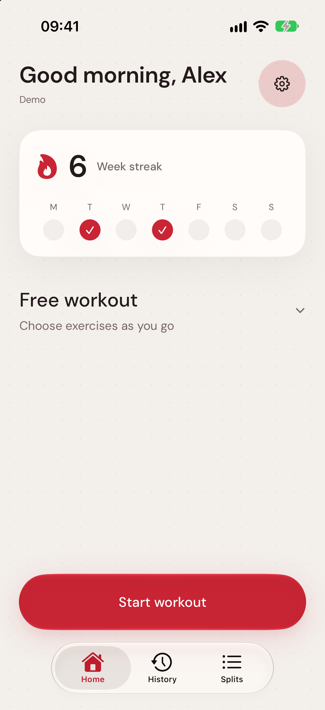 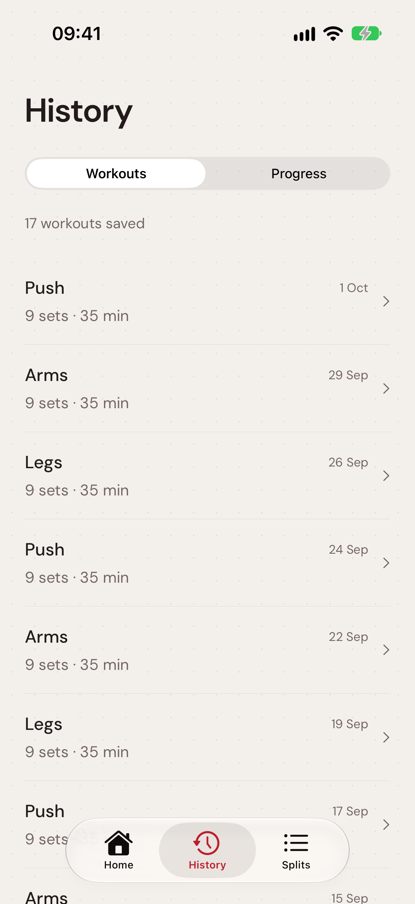 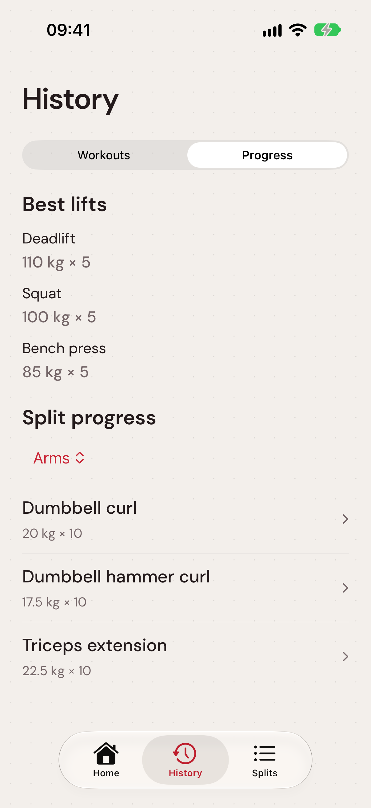 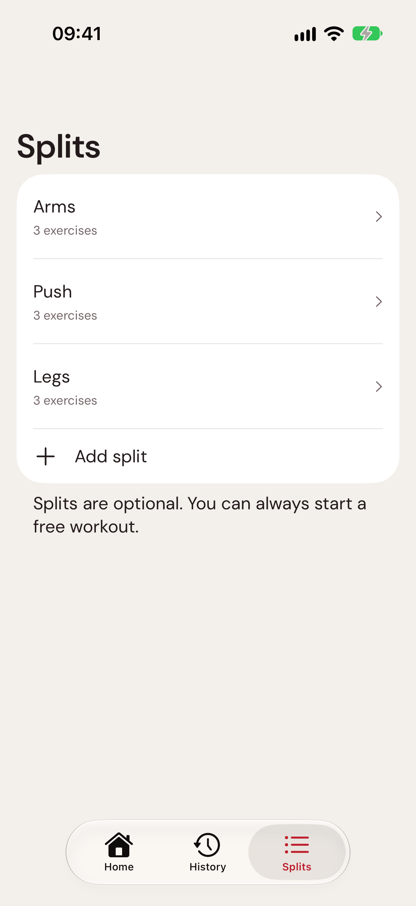

## Change your mind during a workout

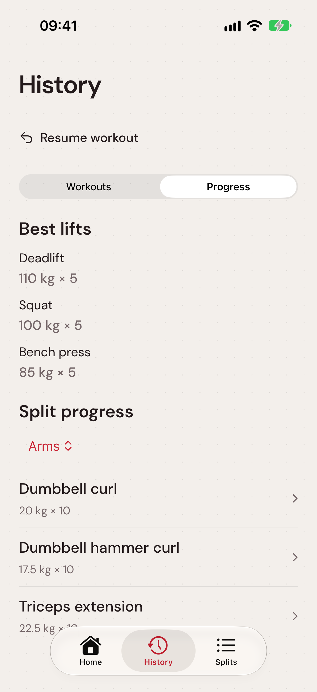 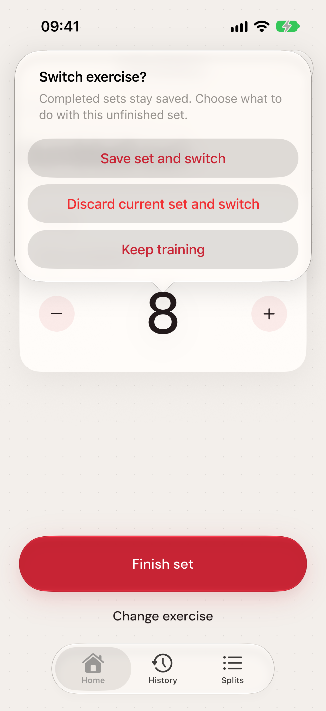 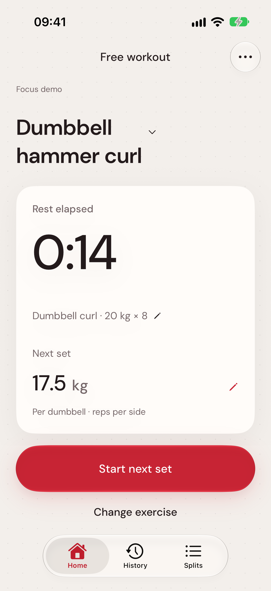

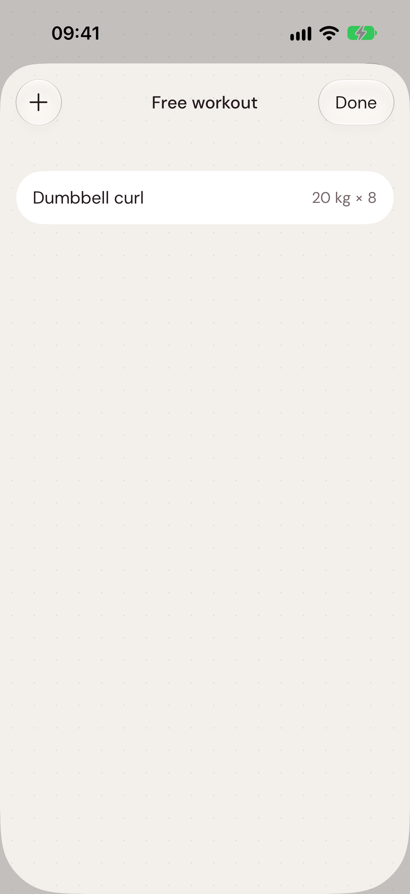 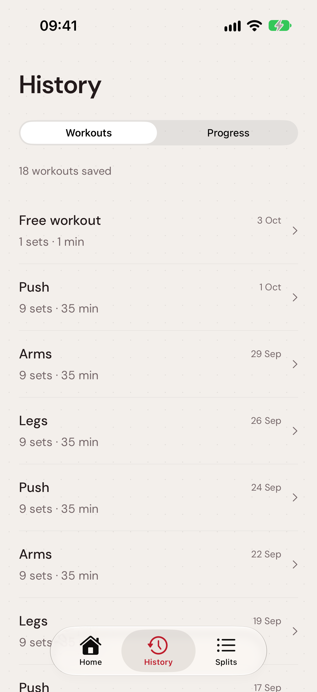 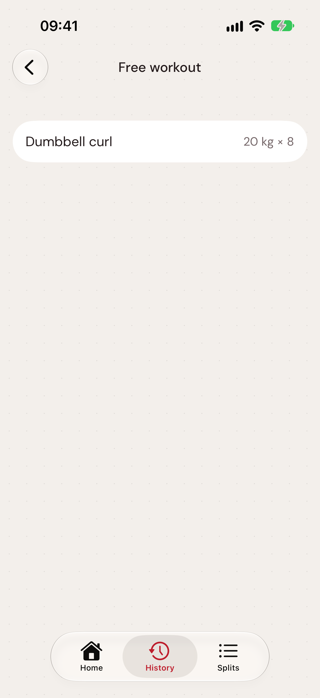 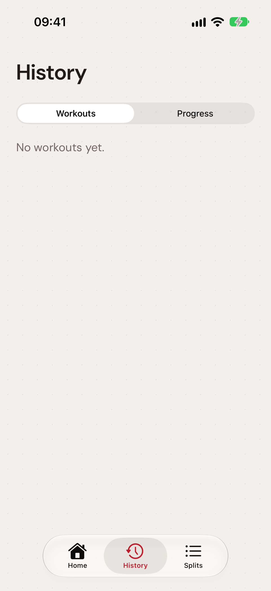

## Dark appearance, large text and increased contrast

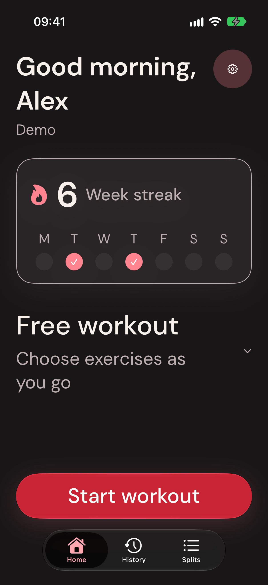 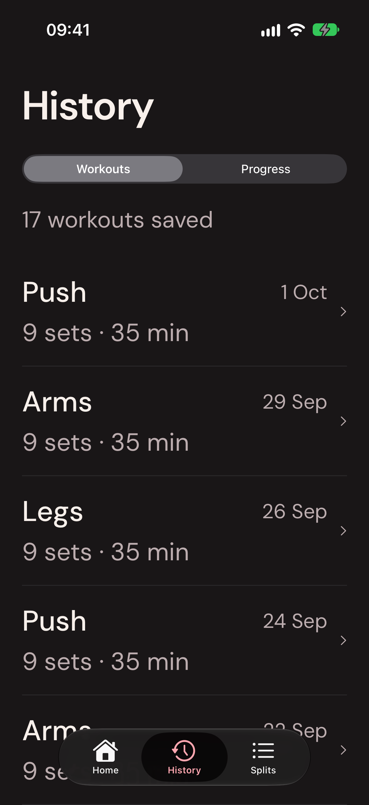 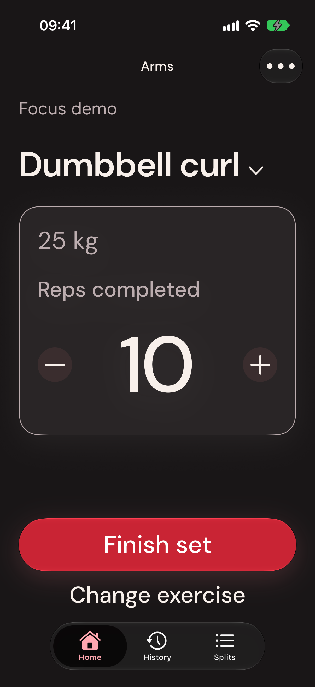 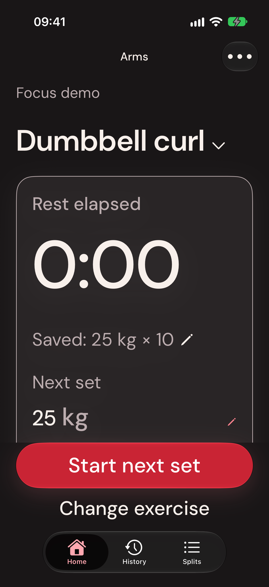

The numbered `redesign-*` captures also cover exercise search, editable weight, corrections, before/after progress and onboarding. See [the page review](../../docs/GYM-FLOW-REVIEW.md) and [verification](../../VALIDATION.md) for the behavior covered and its limits. Simulator automation intentionally resets only this prototype's local storage.
