# Onboarding V2 — actual simulator captures

These are captures of the running SwiftUI app, not mockups. The default gallery uses iPhone 17 / iOS 27; its settled rest/comparison and workout-record captures use iPhone 17e. `dark-large/` uses dark appearance, accessibility-large text and increased contrast. `medium/` contains the iPhone 17e route (390 × 844 points), including fractional scrolling minutes and the final labeled timing editor.

## Workout questions

One answer at a time: days/week, visit duration, reps, sets and exercises. Only then do scrolling, rest timing, logging/review and set timing appear.

  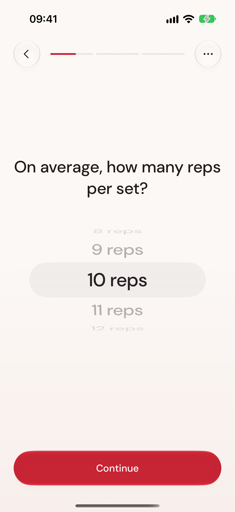

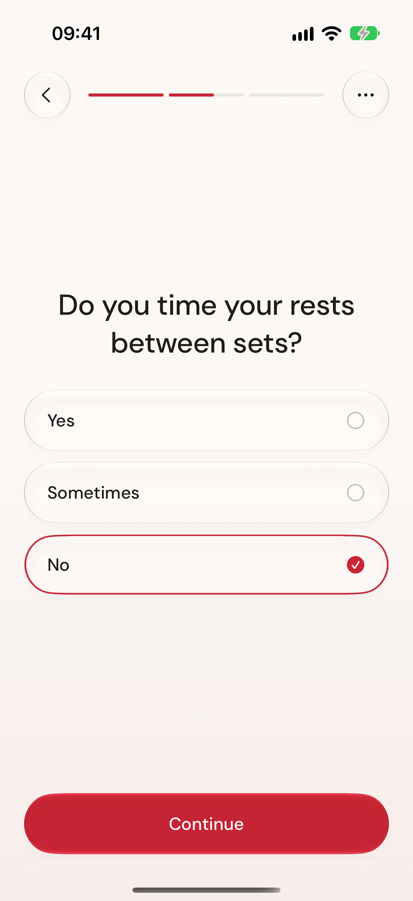 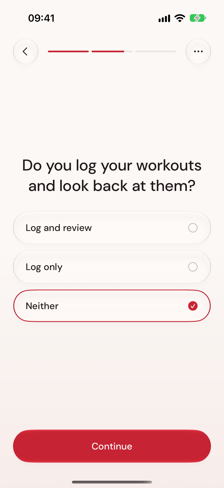 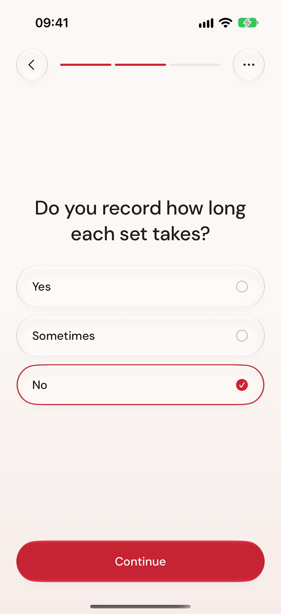

## A connected explanation

Reported scrolling becomes possible phone-free time while visit duration and necessary rest remain. An illustrative upward rest counter and a same-weight rep example lead into an outlined future record. The personal example shows 34 minutes/visit, 6 h 48 min over four weeks and 216 sets that could be tracked. None creates saved workouts or a prediction of body changes.

[Watch the actual focus → rest → progress sequence](focus-rest-progress.mp4). This example uses five scrolling breaks at half a minute each: 2.5 min/visit and 30 min over four weeks. The four-week training record remains 216 sets and approximately 2,160 reps. The recording is a continuous excerpt from the successful simulator test; it has no recorded sound.

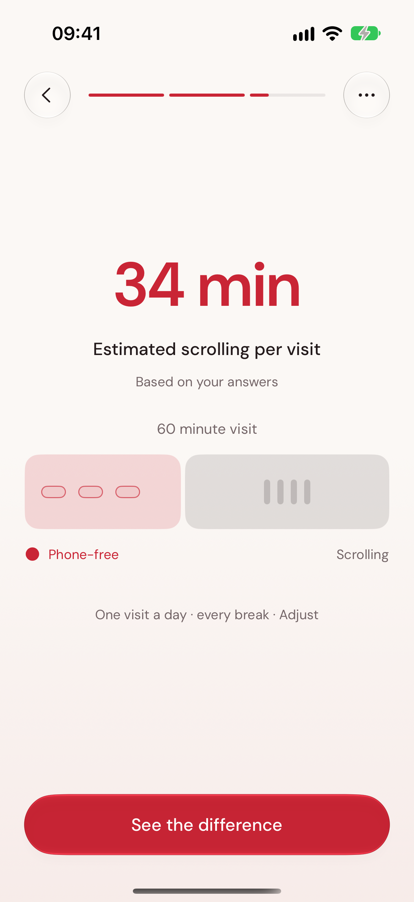 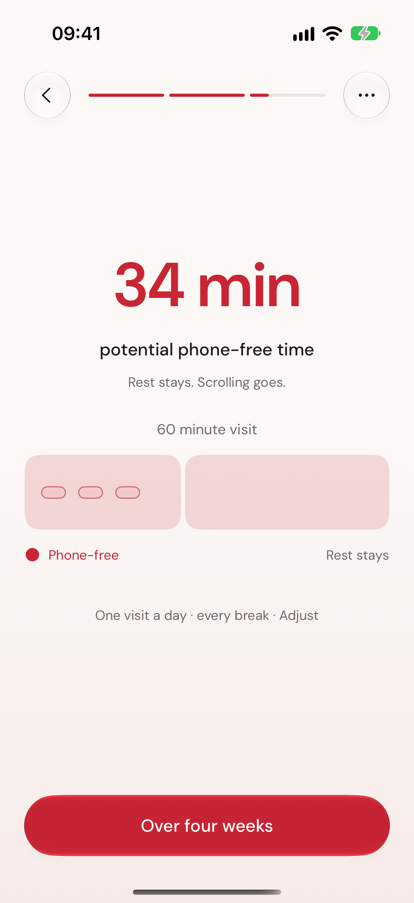 

## Real workout records

Saved sets show elapsed set time and gaps. The timing editor keeps persistent labels. The actual last-four-week report counts recorded sessions, separately from onboarding projections.

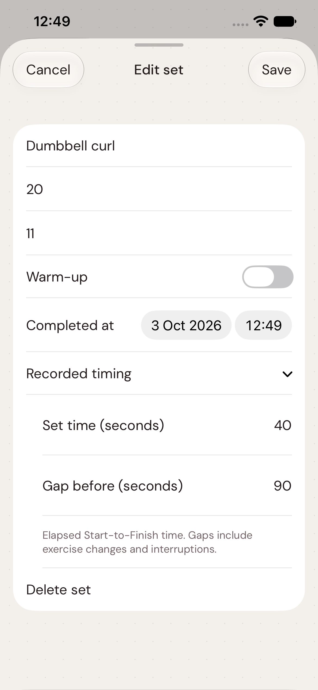 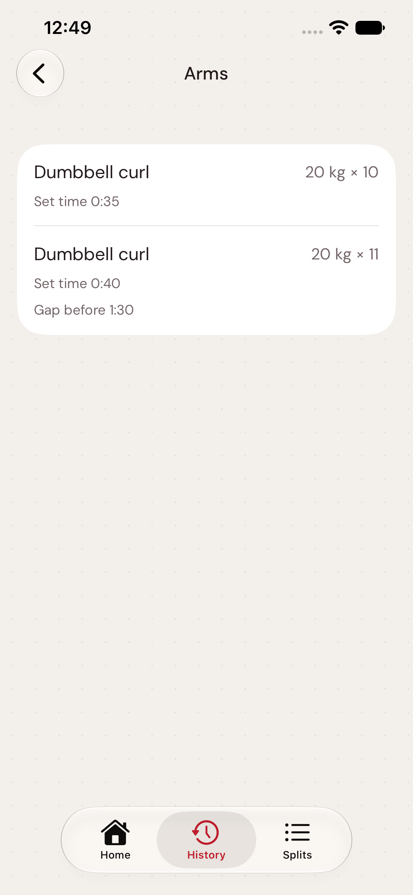 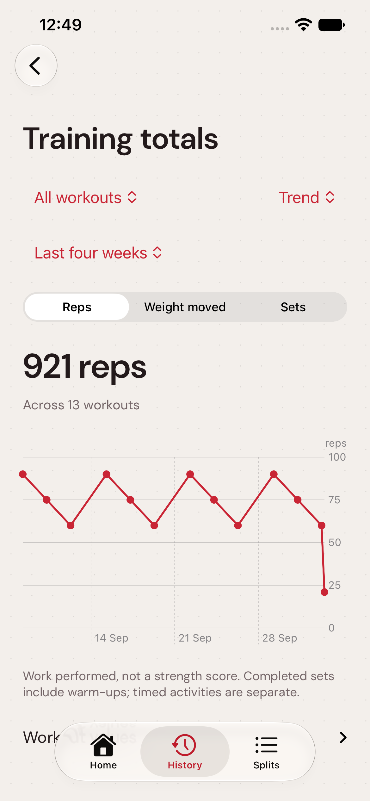

## Larger text

The complete personalized route and timing/history/report route passed with dark appearance, accessibility-large text and increased contrast. Question content scrolls when necessary while Continue stays reachable. Frequency becomes a single wheel at accessibility sizes.

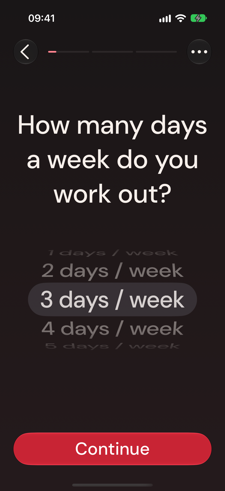 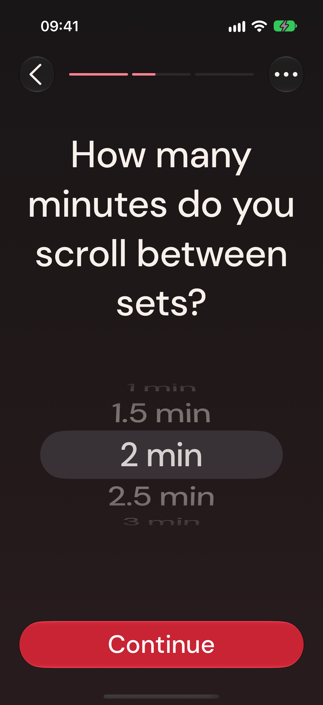 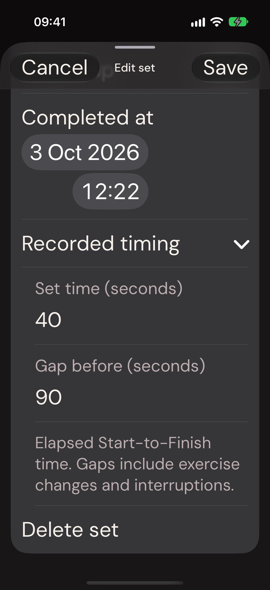

These captures prove visible simulator behavior. They do not establish physical haptic feel, sound volume, manual VoiceOver usability or users' animation preferences. See [validation](../../VALIDATION.md) for the test runs and remaining limits.
